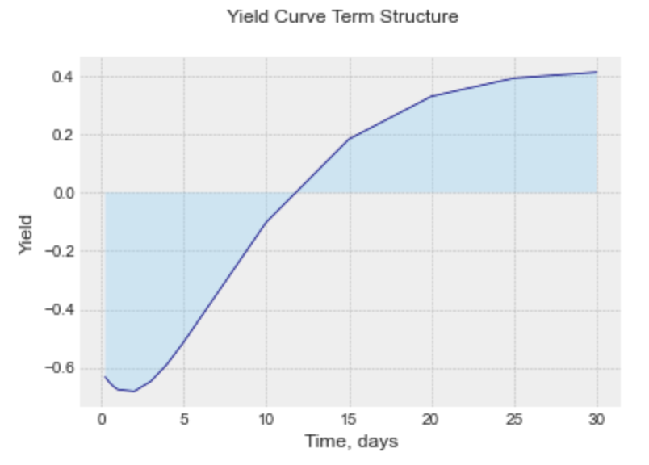

-----------------
# PyCurve - Python Yield Curve Toolkit

-----------------
## What is it ? 

*PyCurve* is a Python package that provides to user high level 
yield curve usefull tool. For example you can istanciate a Curve 
and get a rate, a discount factor, even forward rate given multiple
methodology from Linear Interpolation to parametrization methods 
as Nelson Siegel or Bjork-Christenssen. PyCurve is also able to provide
solutions in order to build yield curve or price Interest rates derivatives 
via Vasicek or Hull and White.

-----------------

## Features 

Below this is the features that this package tackle :
- Curve Smoothing:
  - Create Curve Object with two numpy array (t,rt)
  - Linear interpolation given a Curve 
  - Cubic interpolation given a Curve 
  - Nelson Siegel and Svensson model creation and components plotting
  - Nelson Siegel and Svensson calibration given a Curve
  - Bjork Christensen and Augmented (6 factors) model creation and components plotting
- Stochastic Modelling:
  - Vasicek Model Simulation
  - Hull and WHite Model Simulation
  - Create Simulation Object given a simulation numpy array in order to get from 
    simulated model rate Curve, Discount Factor, Forward Rate...
  
- More to come:
  - CIR model will be implemented as soon as Euro Zone Rate will become positive.
  - Model Calibration
  - A "forward_curve" method will be implemented for each model in order to have directly 
    the whole forward curve x days in y days
    
-----------------

## How to install
From pypi
```sh
pip install PyCurve
```

From pypi specific version 
```sh
pip install PyCurve==0.0.3
```

From Git 
```sh
git clone https://github.com/ahgperrin/PyCurve.git
pip install -e . 
```

# Objects

## Curve Object

This object consists in a simple yield curve encapsulation. This object is used by others class to encapsulate results
or in order to directly create a curve with data obbserved in the market.

| Attributes  | Type    | Description                                 |
| :----------:|:--------| :-------------------------------------------|
| rt          | Private | Interest rates as float in a numpy.ndarray  |
| t           | Private | Time  as float or int in a numpy.ndarray    |


| Methods             | Type    | Description               | Return
| :------------------:|:--------| :-------------------------| :----------|
| get_rate            | Public  | rt getter                 | _rt        |
| get_time            | Public  | rt getter                 | _t         |
| set_rate            | Public  | rt getter                 | None       |
| set_time            | Public  | rt getter                 | None       |
| is_valid_attr(attr) | Private | Check attributes validity | attribute  |
| plot_curve()        | Public  | Plot Yield curve          | None       |

### Example

```sh
from PyCurve.curve import Curve
rate = np.array([0.25, 0.5, 0.75, 1., 2., 
        3., 4., 5., 10., 15., 
        20.,25.,30.])
time = np.array([-0.63171, -0.650322, -0.664493, -0.674608, -0.681294,
        -0.647593, -0.587828, -0.51251, -0.101804,  0.182851,
        0.32962,0.392117,  0.412151])
curve = Curve(rate,time)
curve.plot_curve()
print(curve.get_rate)
print(curve.get_time)
```
```yaml

[-0.63171  -0.650322 -0.664493 -0.674608 -0.681294 -0.647593 -0.587828
 -0.51251  -0.101804  0.182851  0.32962   0.392117  0.412151]
  
[ 0.25  0.5   0.75  1.    2.    3.    4.    5.   10.   15.   20.   25.
 30.  ]

```


## Simulation Object 

This object consists in a simple simulation encapsulation. This object is used by others class to encapsulate results
of monte carlo simulation. This Object has build in method that could perform the conversion from a simulation to 
a yield curve or to a discount factor curve.

| Attributes  | Type    | Description                                      |
| :----------:|:--------| :------------------------------------------------|
| sim         | Private | Simulated paths matrix numpy.ndarray             |
| dt          | Private | delta_time  as float or int in a numpy.ndarray   |

| Methods                       | Type    | Description & Params                                                        | Return       |
| :--------------------------- :|:--------| :---------------------------------------------------------------------------| :------------|    
| get_sim                       | Public  | sim getter                                                                  | _rt          |
| get_nb_sim                    | Public  | nb_sim getter                                                               | sim.shape    |
| get_steps                     | Public  | steps getter                                                                | sim.shape    |
| get_dt                        | Public  | dt getter                                                                   | _dt          |
| is_valid_attr(attr)           | Private | Check attributes validity                                                   | attribute    |
| yield_curve()                 | Public  | Create a yield curve from simulated paths                                   | Curve        |
| discount_factor()             | Public  | Convert rate simulation to discount factor                                  | np.ndarray   |
| plot_discount_curve(average)  | Public  | Plot discount factor (average :bool False plot all paths True Plot estimate)| None         |
| plot_simulation()             | Public  | Plot Yield curve                                                            | None         |
| plot_yield_curve()            | Public  | Plot Yield curve                                                            | None         |
| plot_model()                  | Public  | Plot Yield curve                                                            | None         |

### Example
Using Vasicek to Simulate
```sh
from PyCurve.vasicek import Vasicek
vasicek_model = Vasicek(0.02, 0.04, 0.001, -0.004, 50, 30 / 365)
simulation = vasicek_model.simulate_paths(2000) #Return a Simulation and then we can apply Simulation Methods
simulation.plot_yield_curve()
```


```sh
simulation.plot_model()
```


-----------------

# Yield Curve Construction Tools
This section is the description with examples of what you can do with this package
Please note that for all the examples in this section curve is referring to the curve below
you can see example regarding Curve Object in the dedicated section.

```sh
from PyCurve import Curve
rate = np.array([0.25, 0.5, 0.75, 1., 2., 
        3., 4., 5., 10., 15., 
        20.,25.,30.])
time = np.array([-0.63171, -0.650322, -0.664493, -0.674608, -0.681294,
        -0.647593, -0.587828, -0.51251, -0.101804,  0.182851,
        0.32962,0.392117,  0.412151])
curve = Curve(rate,time)
```

## linear
Interpolate any rate from a yield curve using linear interpolation. THis module is build using scipy.interpolate

| Attributes  | Type    | Description                                       |
| :----------:|:--------| :------------------------------------------------ |
| curve       | Private | Curve Object to be intepolated                    |
| func_rate   | Private | interp1d Object used to interpolate               |

| Methods                       | Type    | Description & Params                                                        | Return       |
| :--------------------------- :|:--------| :---------------------------------------------------------------------------| :------------|    
| d_rate(t)                     | Public  | rate interpolation t: float, array,int                                      | float        |
| df_t(t)                       | Public  | discount factor interpolation  t: float, array,int                          | float        |
| forward(t1,t2)                | Public  | forward rate between t1 and t2     t1,t2: float, array,int                  | float        |
| create_curve(t_array)         | Public  | create a Curve object for t values t:array                                  | Curve        |
| is_valid_attr(attr)           | Private | Check attributes validity                                                   | attribute    |


### Example

```sh
from PyCurve.linear import LinearCurve
linear_curve = LinearCurve(curve)
print("7.5-year rate : "+str(linear_curve.d_rate(7.5)))
print("7.5-year discount rate : "+str(linear_curve.df_t(7.5)))
print("Forward rate between 7.5 and 12.5 years : "+str(linear_curve.forward(7.5,12.5)))
```

```yaml
7.5-year rate : -0.307157
7.5-year discount rate : 1.0233404498400862
Forward rate between 7.5 and 12.5 years : 0.5620442499999999
```


## cubic

Interpolate any rate from a yield curve using linear interpolation. THis module is build using scipy.interpolate

| Attributes  | Type    | Description                                       |
| :----------:|:--------| :------------------------------------------------ |
| curve       | Private | Curve Object to be intepolated                    |
| func_rate   | Private | PPoly Object used to interpolate               |

| Methods                       | Type    | Description & Params                                                        | Return       |
| :--------------------------- :|:--------| :---------------------------------------------------------------------------| :------------|    
| d_rate(t)                     | Public  | rate interpolation t: float, array,int                                      | float        |
| df_t(t)                       | Public  | discount factor interpolation  t: float, array,int                          | float        |
| forward(t1,t2)                | Public  | forward rate between t1 and t2     t1,t2: float, array,int                  | float        |
| create_curve(t_array)         | Public  | create a Curve object for t values t:array                                  | Curve        |
| is_valid_attr(attr)           | Private | Check attributes validity                                                   | attribute    |


### Example

```sh
from PyCurve.cubic import CubicCurve
cubic_curve = CubicCurve(curve)
print("10-year rate : "+str(cubic_curve.d_rate(7.5)))
print("10-year discount rate : "+str(cubic_curve.df_t(7.5)))
print("Forward rate between 10 and 20 years : "+str(cubic_curve.forward(7.5,12.5)))
```

```yaml
10-year rate : -0.3036366057950627
10-year discount rate : 1.0230694659050514
Forward rate between 10 and 20 years : 0.6078001168478189
```

## Nelson-Siegel

| Attributes  | Type    | Description                                       |
| :----------:|:--------| :------------------------------------------------ |
| beta0       | Private | Model Coefficient Beta0                           |
| beta1       | Private | Model Coefficient Beta1                           |
| beta2       | Private | Model Coefficient Beta2                           |
| tau         | Private | Model Coefficient tau                             |
| attr_list   | Private | Coefficient list                                  |


| Methods                      | Type    | Description & Params                                                        | Return            |
| :---------------------------:|:--------| :---------------------------------------------------------------------------| :-----------------|    
| get_attr(str(attr))          | Public  | attributes getter                                                           | attribute         |
| set_attr(attr)               | Public  | attributes setter                                                           | None              |
| print_model()                | Public  | print the Ns model set                                                      | None              |
| _calibration_func(x,curve)   | Private | Private method used for calibration method                                  | float:sqr_err     |
| _is_positive_attr(attr)      | Private | Check attributes positivity (beta0 and tau                                  | attribute         |
| _is_valid_curve(curve)       | Private | Check if the curve given for calibration is a Curve Object                  | Curve             |
| _print_fitting()             | Private | Print the result after the calibration                                      | None              |
| calibrate(curve)             | Public  | Minimize _calibration_func(x,curve)                                         | sco.OptimizeResult|
| _time_decay(t)               | Private | Compute the time decay part of the model t (float or array)                 | float,array       |
| _hump(t)                     | Private | Compute the hump part of the model given t (float or array)                 | float,array       |
| rate(t)                      | Public  | Get rate from the model for a given time t (float or array)                 | float,array       |
| plot_calibrated()            | Public  | Plot Model curve against Curve                                              | None              |
| plot_model_params()          | Public  | Plot Model parameters                                                       | None              |
| plot_model()                 | Public  | Plot Model Components                                                       | None              |
| df_t(t)                      | Public  | Get the discount factor from the model for a given time t (float or array)  | float,array       |
| cdf_t(t)                     | Public  | Get the continuous df from the model for a given time t (float or array)    | float,array       |
| forward_rate(t1,t2)          | Public  | Get the forward rate for a given time t1,t2 (float or array)                | float,array       |


### Example
Creation of a model and calibration 

```sh
from PyCurve.nelson_siegel import NelsonSiegel
ns = NelsonSiegel(0.3,0.4,12,1)
ns.calibrate(curve)

```

```yaml
Nelson Siegel Model
============================
beta0 = 0.751506062319988
beta1 = -1.3304971868997248
beta2 = -2.2203178895179176
tau = 2.5493056203052005
____________________________
============================
Calibration Results
============================
CONVERGENCE: NORM_OF_PROJECTED_GRADIENT_<=_PGTOL
Mean Squared Error 0.0042367306926415285
Number of Iterations 20
____________________________
Out[19]:
      fun: 0.0042367306926415285
 hess_inv: <4x4 LbfgsInvHessProduct with dtype=float64>
      jac: array([-2.40077054e-06,  9.51322360e-07, -2.33927462e-07,  7.97278914e-07])
  message: 'CONVERGENCE: NORM_OF_PROJECTED_GRADIENT_<=_PGTOL'
     nfev: 105
      nit: 20
     njev: 21
   status: 0
  success: True
        x: array([ 0.75150606, -1.33049719, -2.22031789,  2.54930562])
```
Plotting and analyse

```sh
ns.plot_calibrated()

```


```sh
ns.plot_model_params()

```


```sh
ns.plot_model()

```

## nelson-siegel-svensson
## bjork-christensen
## bjork-christensen-augmented

# Stochastic Tools

## vasicek
## hull & white

